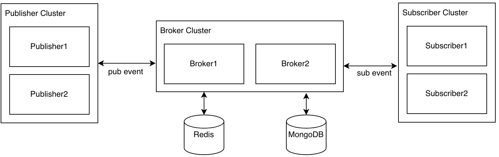

<p align="center">
    
    
    
    
</p>

## 介绍

ideal-bus是一款用于构建事件驱动微服务的中间件。它会为事件的发起者和使用者构建起传输通道，将每一个事件准确交付给对其感兴趣的使用者。

ideal-bus的设计目标是轻量、简单、可靠、易于扩展，其拥有"水平扩展、高可用、海量数据堆积、失败重试、事件重播、延迟消费"等特性。


### 工程结构

```
ideal-bus
    ├── ideal-bus-abstract                     -- 接口/数据定义模块
    ├── ideal-bus-broker                       -- 核心处理模块
    ├── ideal-bus-broker-server                -- 核心处理模块可启动服务
    ├── ideal-bus-client                       -- 客户端SDK，包含事件发布和接收
    ├── ideal-bus-client-spring-boot-starter   -- client starter
    ├── ideal-bus-common                       -- 公共依赖模块
    ├── ideal-bus-samples                      -- 示例
    ├── ideal-bus-storage-mongo                -- MongoDB存储库
    └── ideal-bus-storage-r2dbc                -- 关系型数据库存储库
```


### 什么是事件驱动架构

事件驱动架构是一种用于设计应用的软件架构和模型。对于事件驱动系统而言，事件的捕获、通信、处理和持久保留是解决方案的核心结构。这和传统的请求驱动模型有很大不同。

许多现代应用都采用了事件驱动设计。事件驱动应用可以用任何一种编程语言来创建，因为事件驱动本身是一种编程方法，而不是一种编程语言。事件驱动架构可以最大程度减少耦合度，因此是现代化分布式应用架构的理想之选。

事件驱动架构采用松散耦合方式，因为事件发起者并不知道哪个事件使用者在监听事件，而且事件也不知道其所产生的后续结果。

#### 什么是事件

事件是指系统硬件或软件的状态出现任何重大改变。事件与事件通知不同，后者是指系统发送的消息或通知，用于告知系统的其他部分有相应的事件发生。

而事件的来源可以是内部或外部输入。事件可以来自用户（例如点击鼠标或按键）、外部源（例如传感器输出）或系统（例如加载程序）。

#### 事件驱动架构的工作原理

事件驱动架构由事件发起者和事件使用者组成。事件的发起者会检测或感知事件，并以消息的形式来表示事件。它并不知道事件的使用者或事件引起的结果。 

检测到事件后，系统会通过事件通道从事件发起者传输给事件使用者，而事件处理平台则会在该通道中以异步方式处理事件。事件发生时，需要通知事件使用者。他们可能会处理事件，也可能只是受事件的影响。 

事件处理平台将对事件做出正确响应，并将活动下发给相应的事件使用者。通过这种下发活动，我们就可以看到事件的结果。

#### 事件驱动架构的优势

事件驱动架构可为企业提供一个灵活的系统，能够适应变化并实时做出决策。借助实时态势感知功能，您可以利用反映系统当前状态的所有可用数据，来做出业务决策（无论是人工还是自动）。 

事件在其事件源（如物联网（IoT）设备、应用和网络）发生时即被捕获，因此事件发起者和事件使用者可实时共享状态和响应信息。 

企业可以为自己的系统和应用添加事件驱动架构，以提高应用的可扩展性和响应能力，同时获取改善业务决策所需的数据和环境。


## 软件架构



ideal-bus架构上主要分为三个部分，如上图所示：

- Publisher：事件的发布者，支持集群方式部署。Publisher通过负载均衡模块选择相应的Broker进行事件发布，支持reactive或block的方式进行发布。
- Subscriber：事件的订阅者，支持集群方式部署。一个事件可以被多个Subscriber订阅，同时支持集群和广播的消费方式。
- Broker Server：负责消息的接收、存储、投递、查询等功能，支持集群部署保证高可用，支持水平扩展提升系统性能。


## 特性


## 安装教程


## 使用说明

### 发布示例

```java
// 单条发布
List<String> payload = ImmutableList.of("1", "2", "3");
EventMessage<List<String>> message = EventMessage.of("test_topic", payload)
    .transactionId("123456") // 可选，业务唯一id，支持通过业务id查询事件的发布和订阅信息。
    .key("key") // 可选，相同的key会尽可能的投递到同一个消费队列。
    .externalApp("externalApp") // 可选，外部应用编码，外部应用可通过此编码订阅到属于自己的消息。
    .addHeader("age", "20"); // 可选，事件头，可用于消息过滤、延迟消费。
eventPublisher.publish(message).block(); // .block() 以阻塞的方式发布事件
eventPublisher.publish(message).subscribe(); // .subscribe() 以异步的方式发布事件

// 批量发布
EventMessage<String> messageA = EventMessage.of("test_topic_a", "eventA");
EventMessage<Integer> messageB = EventMessage.of("test_topic_b", 200);
List<EventMessage<?>> list = ImmutableList.of(messageA, messageB);
List<PublishResult> results = eventPublisher.publish(list)
    .collectList() // 
    .block(); // 以阻塞的方式发布事件并获取发布结果
eventPublisher.publish(list).subscribe(); // 以异步的方式发布事件

// 通过EventGenerator构建事件列表并发布
EventGenerator generator = EventGenerator
    .of("test_topic_a", "eventA")
      .addHeader("age", "20")
      .addHeader("expire", "1800")
      .externalApp("app1")
    .then("test_topic_b", 200)
      .externalApp("app1")
    .then("test_topic_c", ImmutableList.of("a", "b"))
      .externalApp("app1");
eventPublisher.publish(generator.get()).subscribe();
```

### 订阅示例

```java
@EventListener(
    name = "testAutoAck", // listener名称，同一个应用下保证唯一
    topic = "example_topic", // 事件的主题
    condition = "age>10", // 订阅条件，订阅Header中的age大于10的事件
    delayExp = "expire", // 延迟表达式，单位秒。这里从Header中动态获取expire的值，也可填写固定值。
    autoAck = true // 是否自动ack，默认true
)
public void testAutoAck(EventContext<List<String>> context) {
  // 参数类型必须是EventContext，泛型为Event中payload参数类型
  System.out.println(String.join(", ", context.getPayload()));
}
```

## 配置说明

### Broker

**ideal.bus.node-id**

必填，Broker实例在集群中的编号，也是该实例下存储消息的分片键。需要保证集群内唯一，建议从1开始递增。


**ideal.bus.refresh-local-cache-interval**

选填，自动更新本地缓存的间隔时间，至少1分钟，默认10分钟。


### Client

**ideal.bus.enabled**

选填，是否开启发布订阅功能，默认true。


**ideal.bus.auto-subscribe**

选填，是否开启自动订阅功能，默认true。


**ideal.bus.application-id**

必填，应用在broker注册的应用ID，必填且保证唯一。


**ideal.bus.broker-addresses**

必填，broker的地址列表，通过逗号连接，如：`127.0.0.1:13266,127.0.0.1:13276`

**注意：** 地址中的端口号为broker的rsocket监听端口。


**ideal.bus.access-token**

选填，应用的连接密钥，如果新增应用时没有分配密钥则不填。